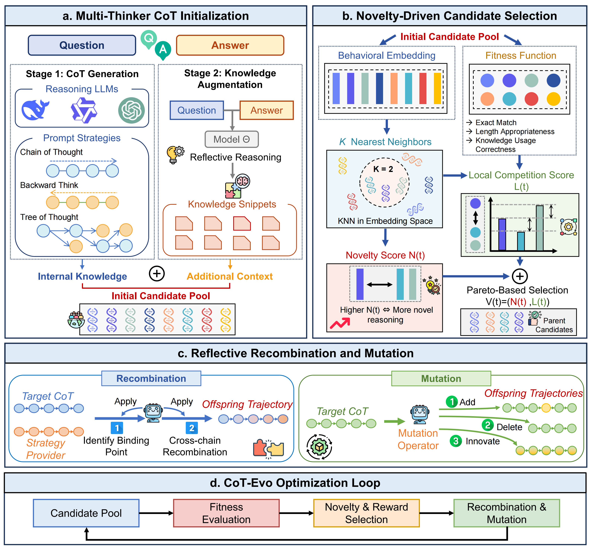

# CoT-Evo: Evolutionary Distillation of Chain-of-Thought for Scientific Reasoning

[](https://arxiv.org/abs/2510.13166)

Official implementation of "[CoT-Evo: Evolutionary Distillation of Chain-of-Thought for Scientific Reasoning](https://arxiv.org/abs/2510.13166)"



## Updates

* [2026/02/12] 🚨 We've released our complete demo code.
* [2026/01/26] 🎉 Our work has been accepted by **ICLR 2026**!

## 🎯 Overview

CoT-Evo is a novel evolutionary framework that generates high-fidelity, compact Chain-of-Thought (CoT) data for scientific reasoning by leveraging multiple teacher models and iterative refinement through novelty-driven selection and reflective variation.

#### Key Features

- **🧠 Multi-Thinker Initialization**: Leverages diverse reasoning models with different prompting strategies
- **🔍 Novelty-Driven Selection**: Implements NSLC (Novelty Search with Local Competition) algorithm
- **🔄 Reflective Variation**: Crossover and mutation operations for CoT refinement
- **📚 Knowledge Augmentation**: Hybrid RAG + generation for domain knowledge enhancement
- **⚡ Production-Ready**: Efficient parallel processing with batch control

## 📁 Project Structure

```
CoT-Evo/
├── config/                    # Configuration files
│   ├── default.yaml           # Default hyperparameters (batch_size, fitness weights)
│   ├── models.yaml            # Model registry with API credentials
│   ├── evolution.yaml         # Evolution engine parameters
│   └── datasets.yaml          # Dataset configurations
├── src/                       # Core implementation
│   ├── core/                  # Core data structures
│   ├── models/                # LLM abstraction layer
│   ├── initialization/        # Multi-thinker initialization
│   ├── selection/             # NSLC selection algorithm
│   ├── variation/             # Crossover & mutation
│   ├── knowledge/             # Knowledge augmentation
│   ├── optimization/          # Evolution engine
│   └── utils/                 # Utilities
├── test/                      # Test files
├── run_evolution.py           # Main entry point for evolution
└── outputs/                   # Output directory (auto-created)
```

## 🚀 Quick Start

### Installation

```bash
# Clone the repository
git clone https://github.com/yourusername/CoT-Evo.git
cd CoT-Evo

# Install dependencies
pip install -r requirements.txt
```

### Configuration

**Step 1: Configure your models** in `config/models.yaml`

Edit the file and replace placeholder values with your actual API credentials:

```yaml
models:
  thinkers:
    - name: "deepseek-r1"
      provider: "openai"
      base_url: "https://api.deepseek.com/v1"
      api_key: "your_actual_api_key_here"  # Replace this!
      model_name: "deepseek-r1"
      description: "DeepSeek-R1 reasoning model"

    - name: "qwen-235b"
      provider: "openai"
      base_url: "https://dashscope.aliyuncs.com/compatible-mode/v1"
      api_key: "your_actual_api_key_here"  # Replace this!
      model_name: "qwen-plus"
      description: "Qwen 235B model"

    # Add more teacher models as needed...

  embedding:
    base_url: "https://api.openai.com/v1"
    api_key: "your_actual_api_key_here"  # Replace this!
    model_name: "text-embedding-3-large"

  judge:
    base_url: "https://api.openai.com/v1"
    api_key: "your_actual_api_key_here"  # Replace this!
    model_name: "gpt-4o"

  knowledge_generator:
    base_url: "https://api.openai.com/v1"
    api_key: "your_actual_api_key_here"  # Replace this!
    model_name: "gpt-4o"
```

**Step 2: Set hyperparameters** in `config/default.yaml`

```yaml
# Parallel processing
parallel:
  batch_size: 20                # Max concurrent samples (default: 20)
  max_concurrent_requests: 100  # Max concurrent API calls

# Fitness function weights
fitness:
  lambda_length: 0.3            # Weight for length score
  lambda_knowledge: 0.5         # Weight for knowledge score
```

**Step 3: Configure evolution** in `config/evolution.yaml`

```yaml
n_generations: 3                # Number of evolution generations
population_size: 6              # Population size per generation
n_vanilla: 4                    # Number of vanilla-generated trajectories
n_knowledge_augmented: 2        # Number of knowledge-augmented trajectories
convergence_threshold: 1.0      # Early stopping threshold
k_neighbors: 3                  # K neighbors for NSLC
epsilon: 0.1                    # Epsilon for NSLC selection
```

**Step 4: Configure dataset** in `config/datasets.yaml`

Your dataset should be registered here. Example:

```yaml
datasets:
  ChemCoTDataset:
    path: "datasets/chemcot/train.json"
    length_percentiles:
      lower: 150                # 15th percentile word count
      upper: 500                # 85th percentile word count
```

## 💻 Basic Usage

### Run Evolution on a Dataset

The main entry point is `run_evolution.py`:

```bash
# Basic usage - run on first 10 samples of ChemCoTDataset
python run_evolution.py --dataset ChemCoTDataset --max-samples 10

# Run on all samples
python run_evolution.py --dataset ChemCoTDataset --max-samples -1

# Use custom evolution config
python run_evolution.py --dataset ChemCoTDataset --max-samples 10 --config config/evolution.yaml

# Enable LLM-as-a-Judge for knowledge evaluation (slower but more accurate)
python run_evolution.py --dataset ChemCoTDataset --max-samples 10 --use-knowledge-judge

# Customize fitness weights
python run_evolution.py --dataset ChemCoTDataset --max-samples 10 --lambda-length 0.4 --lambda-knowledge 0.6

# Use test split instead of train
python run_evolution.py --dataset ChemCoTDataset --max-samples 10 --split test
```

**Output**:
- Results are saved to `outputs/{dataset_name}/{timestamp}/results.json`
- Individual sample logs are saved to `outputs/{dataset_name}/{timestamp}/sample_{idx}_{id}.json`
- Detailed evolution logs are saved to `outputs/{dataset_name}/{timestamp}/sample_{id}/evolution_log.json`

### Output Format

The results JSON contains:

```json
[
  {
    "sample_id": "unique-id",
    "task": "reaction",
    "query": "Problem statement...",
    "ground_truth": "Correct answer",
    "best_answer": "Evolved answer",
    "best_fitness": 1.0,
    "best_reasoning_length": 224,
    "source_model": "qwen3-235b-a22b-thinking-2507",
    "generation_method": "vanilla",
    "full_reasoning": "Complete reasoning chain...",
    "full_answer": "Answer in appropriate format",
    "generations": 1,
    "timestamp": "2026-02-05T13:00:43.794174"
  }
]
```

## 🔧 Configuration Guide

### 1. Model Configuration (`config/models.yaml`)

**Key Parameters**:
- `name`: Unique identifier to reference the model
- `model_name`: Actual model name for API calls (must match API expectation)
- `base_url`: API endpoint URL
- `api_key`: Your API credential
- `provider`: "openai" for OpenAI-compatible APIs

**Adding More Teacher Models**:
Simply add more entries to the `thinkers` list. CoT-Evo will automatically use all registered thinkers.

**Model Selection Modes**:
- **Auto mode** (default): Crossover/mutation use the original trajectory's model
- **Global mode**: Set a global operator model for all operations (optional)

### 2. Parallel Processing (`config/default.yaml`)

**`batch_size`**: Controls how many samples to process in parallel
- Higher value = faster processing, but more API calls
- Recommended: 20-100 depending on API rate limits

**`max_concurrent_requests`**: Maximum concurrent API calls across all samples
- Should be >= batch_size
- Adjust based on API rate limits

### 3. Fitness Function Weights (`config/default.yaml`)

**Formula**: `R(t) = s_EM + λ1 × s_LEN + λ2 × s_KNOW`

- `lambda_length` (λ1): Weight for length appropriateness (default: 0.3)
- `lambda_knowledge` (λ2): Weight for knowledge usage (default: 0.5)

**Note**: Exact match (s_EM) always has weight 1.0.

### 4. Evolution Parameters (`config/evolution.yaml`)

- `n_generations`: Maximum evolution iterations
- `population_size`: Number of trajectories in population
- `n_vanilla`: Vanilla-generated trajectories (Formula 1)
- `n_knowledge_augmented`: Knowledge-augmented trajectories (Formula 2)
- `convergence_threshold`: Early stopping when fitness >= threshold
- `k_neighbors`: Number of neighbors for NSLC selection
- `epsilon`: Small constant to prevent division by zero in NSLC

## 🧪 Supported Datasets

Currently supported datasets (registered in `config/datasets.yaml`):

- **ChemCoTDataset**: Chemistry reaction prediction
- **ChemCoTBench**: Chemistry reasoning benchmarks
- **BioProBench**: Biological protocol reasoning
- **SciKnowEval**: Scientific knowledge evaluation

**Adding Custom Datasets**:

1. Prepare your data in JSON format:
```json
[
  {
    "id": "unique-id",
    "task": "task-type",
    "query": "Problem statement",
    "answer": "Ground truth answer",
    "meta": {
      "gt": "Ground truth for validation"
    }
  }
]
```

2. Register in `config/datasets.yaml`:
```yaml
datasets:
  MyCustomDataset:
    path: "path/to/your/data.json"
    length_percentiles:
      lower: 100
      upper: 400
```

3. Run evolution:
```bash
python run_evolution.py --dataset MyCustomDataset --max-samples 10
```

## 📊 Command-Line Arguments

Full list of arguments for `run_evolution.py`:

| Argument | Type | Default | Description |
|----------|------|---------|-------------|
| `--dataset` | str | Required | Dataset name from config/datasets.yaml |
| `--max-samples` | int | -1 | Max samples to process (-1 for all) |
| `--split` | str | train | Dataset split (train/test) |
| `--config` | str | config/evolution.yaml | Evolution config path |
| `--default-config` | str | config/default.yaml | Default config path |
| `--models` | str | config/models.yaml | Models config path |
| `--output-dir` | str | auto | Output directory (default: outputs/{dataset}/) |
| `--use-knowledge-judge` | flag | False | Enable LLM-as-a-Judge for knowledge |
| `--lambda-length` | float | 0.3 | Weight for length score (λ1) |
| `--lambda-knowledge` | float | 0.5 | Weight for knowledge score (λ2) |

## 🐛 Troubleshooting

**Issue**: API timeout errors
- **Solution**: Reduce `batch_size` in `config/default.yaml`

**Issue**: All trajectories fail with "unbalanced parenthesis"
- **Solution**: This is an answer extraction issue. Check if your model outputs in the expected format

**Issue**: Out of memory errors
- **Solution**: Reduce `max_concurrent_requests` in `config/default.yaml`

**Issue**: Poor fitness scores
- **Solution**:
  - Enable `--use-knowledge-judge` for more accurate evaluation
  - Increase `n_generations` in `config/evolution.yaml`
  - Check if your teacher models are appropriate for the task

## 🤝 Contributing

Contributions are welcome! Please feel free to submit a Pull Request.

## 📝 Citation

```bibtex
@article{feng2025cot,
  title={CoT-Evo: Evolutionary Distillation of Chain-of-Thought for Scientific Reasoning},
  author={Feng, Kehua and Ding, Keyan and Zhu, Zhihui and Liang, Lei and Zhang, Qiang and Chen, Huajun},
  journal={arXiv preprint arXiv:2510.13166},
  year={2025}
}
```

## 📄 License

MIT License - see LICENSE file for details

## 🙏 Acknowledgments

- Original paper authors for the CoT-Evo framework
- OpenAI, DeepSeek, and Qwen teams for excellent LLM APIs

---

**Status**: ✅ Production Ready | Last Updated: 2026-02-05

**Key Features**:
- ✅ Full implementation of CoT-Evo algorithm
- ✅ Efficient parallel processing with batch control
- ✅ Support for multiple teacher models
- ✅ Flexible configuration via YAML files
- ✅ Comprehensive logging and checkpointing
